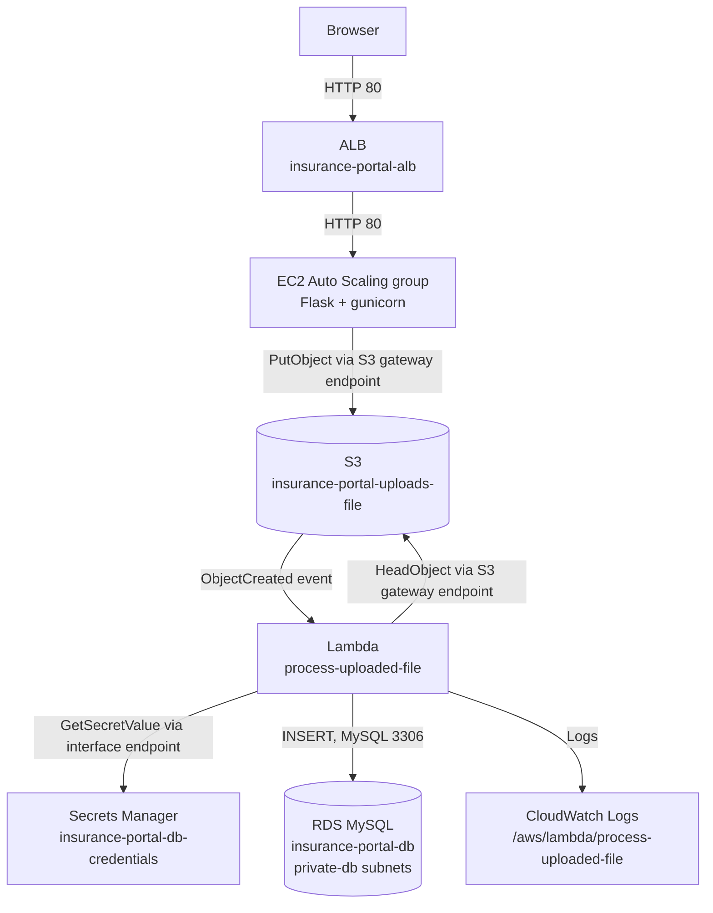

# Insurance Portal on AWS

A document upload portal on AWS in **us-east-1** across two Availability Zones, built for the NAGP Cloud Computing workshop assignment.

**GitHub repository:** [niloymcs17/NAGP-CLOUD-COMPUTING-N.S.-WORKSHOP](https://github.com/niloymcs17/NAGP-CLOUD-COMPUTING-N.S.-WORKSHOP.git)

A user uploads a file to a Flask app on EC2, behind an Application Load Balancer and an Auto Scaling group, which stores it in S3. The upload event triggers a Lambda function that reads the file's metadata, fetches database credentials from Secrets Manager, and writes a record to a private RDS MySQL database.



The full diagram, with subnets and routing, is in [`docs/Cloud_Architecture.md`](docs/Cloud_Architecture.md).

## Repository layout

| Path | Contents |
|---|---|
| [`code/`](code/) | Application and Lambda source. [`code/README.md`](code/README.md) lists every file and holds the **setup, deployment, and cleanup instructions**. |
| [`docs/`](docs/) | The five documents below |
| [`Screen shorts/`](Screen%20shorts/) | Console evidence per resource: IAM users and groups, VPC resource map, subnets, route tables, network ACLs, security groups, S3 bucket, IAM roles, DB subnet group, launch template, target group, load balancer, Auto Scaling group, CloudWatch dashboard and alarm |

Each document owns one subject, so every detail is written down once and referenced elsewhere.

| Document | Owns |
|---|---|
| [`Cloud_Architecture.md`](docs/Cloud_Architecture.md) | The diagram, subnets and routing, security group rules, traffic flows, VPC endpoints |
| [`Component_Description.md`](docs/Component_Description.md) | Purpose, security, and high availability of each AWS component |
| [`Assumptions.md`](docs/Assumptions.md) | Scope, Free Tier constraints, design trade-offs, known limitations |
| [`Bonus_Points.md`](docs/Bonus_Points.md) | Evidence for the three bonus items |
| [`TROUBLESHOOT_CONNECT.md`](docs/TROUBLESHOOT_CONNECT.md) | Temporarily reconnecting to EC2 or RDS, and reverting that access |

## Quick start

1. Build the deployment packages:

   ```powershell
   cd code
   .\package.ps1
   ```

2. Work through the nine deployment steps in [`code/README.md`](code/README.md), in order: network, S3, RDS and secret, IAM roles, web tier, Lambda, VPC endpoints, S3 trigger, verification.
3. Open the ALB DNS name, upload a file, and confirm the record in CloudWatch Logs `/aws/lambda/process-uploaded-file`.

## Key AWS resources

| Resource | Name |
|---|---|
| VPC | `insurance-portal-vpc` (`10.0.0.0/16`) |
| Load balancer | `insurance-portal-alb` |
| Auto Scaling group | `insurance-portal-asg` (desired 2, max 4) |
| S3 bucket | `insurance-portal-uploads-file` |
| Lambda | `process-uploaded-file` (Python 3.12) |
| RDS | `insurance-portal-db` (MySQL 8.0, private) |
| Secret | `insurance-portal-db-credentials` |
| VPC endpoints | `s3-gateway-endpoint`, `secretsmanager-endpoint` |

## Submission

The source ZIP is `code/dist/insurance-portal-source.zip`, built by `code/package.ps1`. It contains only source code and instructions — no credentials, no installed dependencies.
