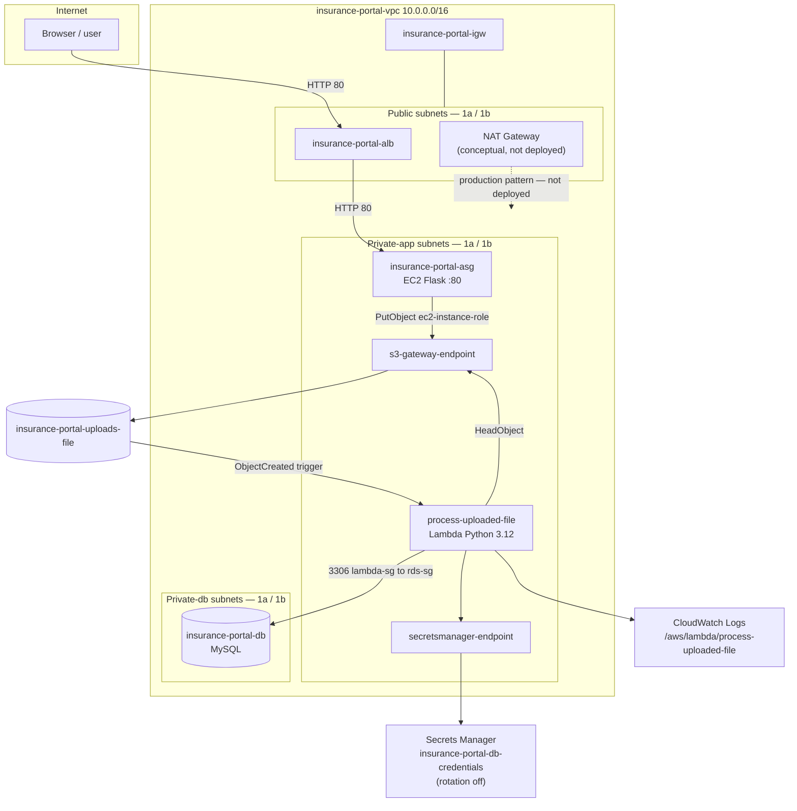

# Cloud architecture — insurance portal

The **Cloud Architecture Diagram** deliverable: what to draw, how the components connect, how traffic flows. Region **us-east-1 (N. Virginia)**, two Availability Zones.

Owns the network layout: subnets, routing, security groups, traffic flows, VPC endpoints. Per-service detail is in [`Component_Description.md`](Component_Description.md), trade-offs in [`Assumptions.md`](Assumptions.md).

---

## 1. Reference layout

Solid lines are deployed paths; the dashed NAT gateway is conceptual only.

**Label on the submitted image**, using the names above: the VPC and its CIDR, both AZs as columns, the six subnets (section 2), `insurance-portal-igw`, the conceptual NAT gateway, `insurance-portal-alb`, `insurance-portal-asg`, `process-uploaded-file`, `insurance-portal-uploads-file`, `insurance-portal-db`, both VPC endpoints, `insurance-portal-db-credentials`, and the Lambda log group. `app-target-group` and `insurance-portal-it` are optional.

**Legend and notes**

- **Solid arrow** — deployed traffic or event path.
- **Dashed arrow** — NAT gateway: production pattern, **not deployed** (Free Tier).
- `s3-gateway-endpoint` serves **both** EC2 (`PutObject`) and Lambda (`HeadObject`); it is not a separate public-internet path.
- **CloudWatch is Lambda only** — EC2 logs stay on the instance, so draw no ASG → CloudWatch arrow.
- **No EC2 → RDS arrow**; only Lambda reaches MySQL on 3306. Mark it "RDS: `lambda-sg` → `rds-sg` :3306 only".
- S3 and Secrets Manager sit outside the VPC as regional managed services.

---

## 2. Subnets and routing

| Subnet name | AZ | CIDR | Route table | Default route |
|---|---|---|---|---|
| `public-subnet-1` | us-east-1a | 10.0.1.0/24 | `public-route-table` | `0.0.0.0/0` → IGW |
| `public-subnet-2` | us-east-1b | 10.0.2.0/24 | `public-route-table` | `0.0.0.0/0` → IGW |
| `private-app-subnet-1` | us-east-1a | 10.0.11.0/24 | `private-app-route-table` | `0.0.0.0/0` → IGW (NAT stand-in) + S3 prefix via gateway endpoint |
| `private-app-subnet-2` | us-east-1b | 10.0.12.0/24 | `private-app-route-table` | Same |
| `private-db-subnet-1` | us-east-1a | 10.0.21.0/24 | `private-db-route-table` | Local `10.0.0.0/16` only |
| `private-db-subnet-2` | us-east-1b | 10.0.22.0/24 | `private-db-route-table` | Local only |

Public subnets hold the load balancer; private-app hold the EC2 group and the Lambda network interfaces; private-db hold the RDS subnet group.

**DNS.** Enable **DNS resolution** and **DNS hostnames** on the VPC — private DNS on the Secrets Manager interface endpoint requires both.

**NAT.** Drawn but not deployed, so `private-app-route-table` routes `0.0.0.0/0` to the internet gateway as a stand-in. That does not give Lambda access to public AWS APIs (section 5); the cost reasoning is in [`Assumptions.md`](Assumptions.md) section 4.

---

## 3. Network security

| Security group | Attached to | Inbound |
|---|---|---|
| `alb-sg` | ALB | HTTP 80 from `0.0.0.0/0` |
| `ec2-app-sg` | EC2 instances | HTTP 80 from `alb-sg` only (final state: no SSH, no RDS) |
| `lambda-sg` | Lambda ENIs | HTTPS 443 from `lambda-sg`, for the Secrets Manager interface endpoint |
| `rds-sg` | RDS | MySQL 3306 from `lambda-sg` only |

Groups reference other groups rather than CIDR ranges, so the only allowed paths are `alb-sg` → `ec2-app-sg` on 80 and `lambda-sg` → `rds-sg` on 3306. Network ACLs (`public-nacl`, `app-nacl`, `db-nacl`) add a second, stateless filter per tier; `db-nacl` allows MySQL from the two private-app CIDRs only.

---

## 4. End-to-end traffic flows

### Flow A — user uploads a file (synchronous web path)

| Step | From | To | Protocol / API | Purpose |
|---|---|---|---|---|
| 1 | User | `insurance-portal-alb` | HTTP 80 | Load the upload page or submit the form |
| 2 | ALB | EC2 (ASG member) | HTTP 80 | `GET /` or `POST /upload` |
| 3 | EC2 | S3, via `s3-gateway-endpoint` | HTTPS, `PutObject` | Store the file with its Content-Type |
| 4 | EC2 | User, via ALB | HTTP | Success or error response |

The app tier has no route to RDS and never writes metadata itself.

### Flow B — metadata processing (asynchronous, serverless)

| Step | From | To | Protocol / API | Purpose |
|---|---|---|---|---|
| 1 | S3 | Lambda | Event notification | New object key in the bucket |
| 2 | Lambda | S3, via `s3-gateway-endpoint` | `HeadObject` | Read Content-Type, confirm the object |
| 3 | Lambda | Secrets Manager, via `secretsmanager-endpoint` | `GetSecretValue` | Load DB credentials (cold start; cached when warm) |
| 4 | Lambda | RDS | TCP 3306, private IP | `INSERT` into `uploaded_files` |
| 5 | Lambda | CloudWatch Logs | Put log events | Audit trail and bonus evidence |

### Flow C — Auto Scaling (capacity)

| Trigger | Action |
|---|---|
| Average ASG CPU above the 50% target | Raise desired capacity, up to 4 |
| CPU below target through the cooldown | Lower desired capacity back toward 2 |
| ELB health check failure | Replace the instance |

Scaling is driven by **EC2 CPU and health checks only** — not by S3 uploads or Lambda activity.

---

## 5. VPC endpoints

| Endpoint | Type | Cost | Used for |
|---|---|---|---|
| `s3-gateway-endpoint` | Gateway, on `private-app-route-table` | No hourly charge | `HeadObject` from Lambda, `PutObject` from EC2 |
| `secretsmanager-endpoint` | Interface, both private-app subnets, private DNS on | Hourly per subnet | `GetSecretValue` from Lambda |

**Why they are required.** A VPC-attached Lambda has private IPs only, and an internet gateway drops traffic from private addresses, so the IGW stand-in gives it no path to the public S3 or Secrets Manager APIs. Without the S3 endpoint the function logs the object key then times out on `HeadObject`; without the Secrets Manager endpoint it logs the Content-Type then times out on the credential lookup.

RDS needs no endpoint — its address is already private inside the VPC.

---

## 6. High availability

Every tier spans us-east-1a and us-east-1b: ALB nodes in both public subnets, ASG instances in both private-app subnets, Lambda attached to both, and the DB subnet group across both private-db subnets. Per-tier mechanisms are in [`Component_Description.md`](Component_Description.md); the single-AZ RDS trade-off is in [`Assumptions.md`](Assumptions.md) section 2.
